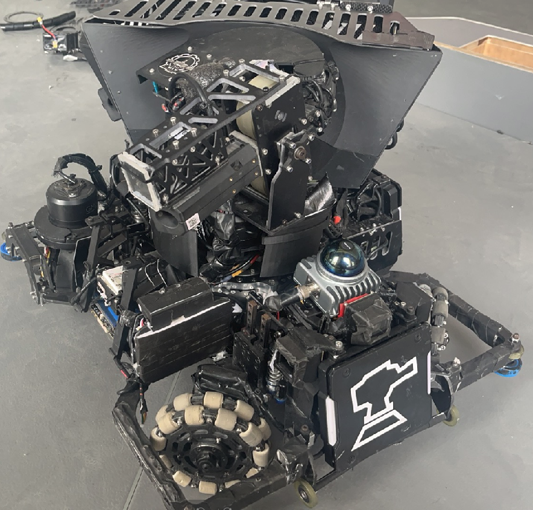
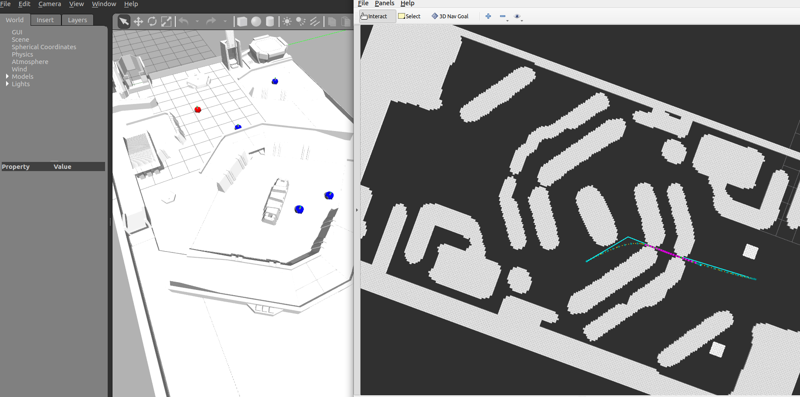
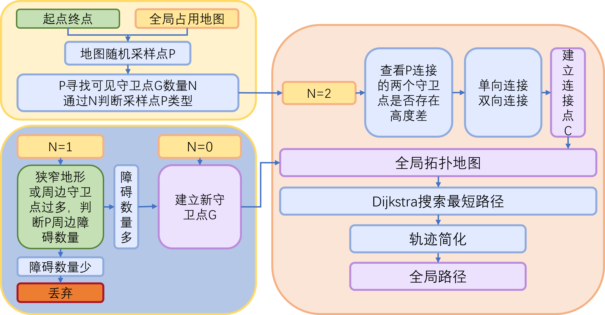
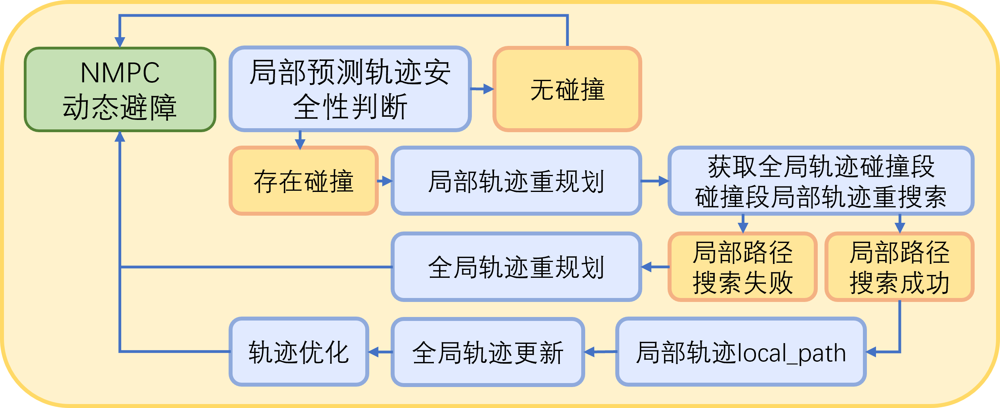
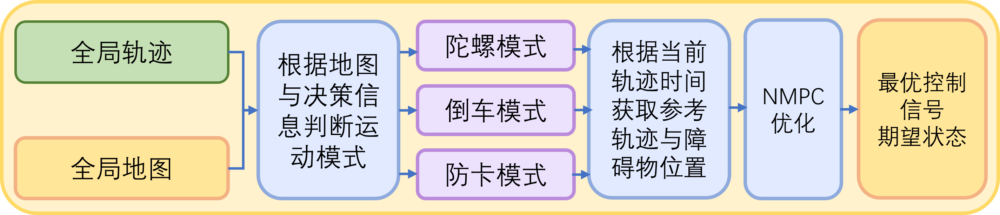
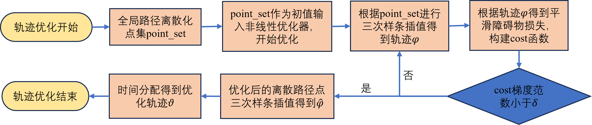

# Sentry Planning System

[English](#english) | [中文](#中文)

---

## English

### Overview

The **Sentry Planning System** is a comprehensive autonomous navigation and path planning framework designed for the RoboMaster University Championship (RMUC) sentry robot. This system integrates advanced trajectory generation, tracking, and control algorithms to enable the sentry robot to navigate autonomously in complex competition environments.

The system combines global path planning with local trajectory optimization using state-of-the-art algorithms including A* search, topological path planning, and Nonlinear Model Predictive Control (NMPC) based on the OCS2 optimal control framework.

### Key Features

- **Multi-level Path Planning**: Hierarchical planning architecture with global and local planners
- **Topological Path Search**: Efficient path finding in complex environments with multiple obstacles
- **Trajectory Optimization**: Smooth trajectory generation considering robot dynamics and constraints
- **NMPC-based Tracking**: Real-time trajectory tracking using optimal control
- **ROS Integration**: Full integration with ROS ecosystem for simulation and real robot deployment
- **Gazebo Simulation**: Complete simulation environment for testing and validation

### Robot Platform



The system is designed for the RoboMaster sentry robot, a four-wheeled omnidirectional mobile robot with the following characteristics:
- **Differential drive configuration** with independent wheel control
- **3D LiDAR sensor** for environment perception
- **IMU** for state estimation
- **Onboard computing** for real-time control
- **Combat capabilities** integrated with planning system (HP monitoring, strategic positioning)

### System Architecture



The system is organized into several key components:

```
sentry_planning/
├── src/
│   ├── sentry_planning/          # Main planning modules
│   │   ├── trajectory_generation/  # Global path planning
│   │   ├── trajectory_tracking/    # Local trajectory tracking
│   │   ├── rviz_plugins/           # Visualization tools
│   │   └── waypoint_generator/     # Goal setting utilities
│   ├── ocs2/                      # OCS2 optimal control toolbox
│   ├── ocs2_robotic_assets/       # Robot models and assets
│   ├── rm2023_sentry_msgs/        # Custom ROS messages
│   └── sentry_gazebo_2024/        # Gazebo simulation environment
├── IMG/                           # Documentation images
└── 哈尔滨工业大学哨兵开源技术文档.pdf  # Technical documentation (Chinese)
```

### Module Details

#### 1. Trajectory Generation Module (`trajectory_generation`)

The global path planning module responsible for generating collision-free paths from start to goal.

**Key Components:**
- **A* Search** (`Astar_searcher.h/cpp`): Grid-based path finding algorithm
- **Topological Search** (`TopoSearch.h/cpp`): Graph-based path planning for finding multiple path candidates
- **Path Smoothing** (`path_smooth.h/cpp`): B-spline based path smoothing
- **Reference Path Generator** (`reference_path.h/cpp`): Generates velocity and acceleration profiles
- **Planning Manager** (`plan_manager.h/cpp`): Coordinates all planning components
- **Replanning FSM** (`replan_fsm.h/cpp`): Finite state machine for dynamic replanning





**Features:**
- Multi-layer height map for bridge and terrain handling
- Dynamic obstacle avoidance
- Path optimization considering kinematic constraints
- Support for different motion modes (normal, spinning top mode)

**Launch Files:**
- `global_searcher.launch`: Standard configuration
- `global_searcher_debug.launch`: Debug mode with additional logging
- `global_searcher_sim.launch`: Simulation environment configuration

#### 2. Trajectory Tracking Module (`trajectory_tracking`)

Local trajectory tracking and control module using NMPC for optimal control.

**Key Components:**
- **Local Planner** (`local_planner.h/cpp`): NMPC-based trajectory tracking
- **Tracking Manager** (`tracking_manager.h/cpp`): Manages tracking execution and coordination
- **Kalman Filter** (`KMF.h/cpp`): State estimation and filtering
- **OCS2 Integration** (`ocs2_sentry/`): 
  - Robot dynamics model
  - Cost functions
  - Constraints (kinematic, collision avoidance)





**Features:**
- Real-time NMPC solving using SQP algorithm
- Collision avoidance constraints
- Adaptive velocity control based on environment
- Support for special maneuvers (spinning top, quick dodge)
- Integration with robot HP and status monitoring

**Parameters:**
- Maximum velocity, acceleration, angular velocity
- Planning horizon and time step
- Collision avoidance parameters
- Map parameters (resolution, size, boundaries)

#### 3. RViz Plugins Module (`rviz_plugins`)

Custom RViz visualization plugins for enhanced planning visualization.

**Components:**
- **Goal Tool** (`goal_tool.h/cpp`): Interactive 3D goal setting in RViz
- **Pose Tool** (`pose_tool.h/cpp`): Robot pose visualization
- **Probability Map Display** (`probmap_display.h/cpp`): Display probability maps
- **Multi-Probability Map Display** (`multi_probmap_display.h/cpp`): Multiple map layers
- **Aerial Map Display** (`aerialmap_display.h/cpp`): Top-down map view

#### 4. Waypoint Generator Module (`waypoint_generator`)

Simple utility for generating and managing navigation waypoints.

**Features:**
- Manual waypoint specification
- Support for waypoint sequences
- Goal publishing to planning system

### Dependencies

**System Requirements:**
- Ubuntu 20.04 (recommended)
- ROS Noetic
- C++17 or higher
- CMake 3.10+

**Core Dependencies:**
- Eigen3
- OpenCV
- PCL (Point Cloud Library)
- Boost
- Qt5 (for RViz plugins)

**ROS Packages:**
- roscpp
- rospy
- std_msgs
- geometry_msgs
- nav_msgs
- sensor_msgs
- visualization_msgs
- tf2
- pcl_ros
- gazebo_ros

**OCS2 Dependencies:**
- HPIPM (High-Performance Interior Point Method)
- Pinocchio (rigid body dynamics)
- urdfdom

### Installation

#### 1. Install System Dependencies

```bash
sudo apt-get update
sudo apt-get install -y \
    ros-noetic-joint-state-publisher-gui \
    ros-noetic-robot-state-publisher \
    ros-noetic-xacro \
    ros-noetic-pcl-ros \
    ros-noetic-image-transport \
    ros-noetic-camera-info-manager \
    ros-noetic-gazebo-ros \
    ros-noetic-gazebo-ros-control \
    ros-noetic-gazebo-ros-pkgs \
    ros-noetic-ros-control \
    ros-noetic-ros-controllers \
    libeigen3-dev \
    libopencv-dev \
    libpcl-dev
```

#### 2. Install Sophus

```bash
cd ~
git clone https://github.com/strasdat/Sophus.git
cd Sophus/
mkdir build && cd build
cmake ..
make -j$(nproc)
sudo make install
```

#### 3. Clone and Build

```bash
# Create workspace
mkdir -p ~/sentry_ws/src
cd ~/sentry_ws/src

# Clone the repository
git clone <repository_url>

# Build the workspace
cd ~/sentry_ws
catkin_make -j$(nproc)

# Source the workspace
source devel/setup.bash
```

### Usage

#### Simulation Mode

##### 1. Launch Gazebo Environment

```bash
roslaunch mbot_gazebo mbot_rmuc_lidar_gazebo.launch
```

After launching, adjust the models:
- Position `RMchangdi1230` model at (0, 0, 0)
- Position `mrobot` model at (5, 7.5, 0.3)

##### 2. Start Robot Controller

```bash
roslaunch mbot_control mbot_control.launch
```

##### 3. Start Mapping (Optional for SLAM)

```bash
roslaunch fast_lio mapping_velodyne.launch
```

##### 4. Start Path Planning

```bash
roslaunch trajectory_generation global_searcher.launch
```

##### 5. Start Trajectory Tracking

```bash
roslaunch tracking_node trajectory_planning.launch
```

##### 6. Set Navigation Goal

In RViz:
- Press `G` or select the "3D Goal" tool
- Click on the map to set the target position

#### Standalone Planning Module

To run only the planning module without full navigation:

```bash
# Build planning packages only
catkin_make -DCATKIN_WHITELIST_PACKAGES="trajectory_generation;rviz_plugins;tracking_node;waypoint_generator"

# Launch planning
roslaunch trajectory_generation global_searcher.launch

# Set goal in RViz (press 'G' and click on map)
```

### Configuration

#### Map Configuration

Before running, configure the map files in launch files:

**For `global_searcher.launch`:**
```xml
<param name="trajectory_generator/occ_file_path" type="string" value="/path/to/occ_map.png"/>
<param name="trajectory_generator/bev_file_path" type="string" value="/path/to/bev_map.png"/>
<param name="trajectory_generator/distance_map_file_path" type="string" value="/path/to/distance_map.png"/>
```

**For `trajectory_planning.launch`:**
```xml
<param name="tracking_node/occ_file_path" type="string" value="/path/to/occ_map.png"/>
<param name="tracking_node/bev_file_path" type="string" value="/path/to/bev_map.png"/>
<param name="tracking_node/distance_map_file_path" type="string" value="/path/to/distance_map.png"/>
<param name="tracking_node/taskFile" type="string" value="$(find tracking_node)/cfg/task.info"/>
```

#### Robot Parameters

Key parameters can be adjusted in launch files:

- **Velocity Limits**: `reference_v_max`, `local_v_max`
- **Acceleration Limits**: `reference_a_max`, `local_a_max`
- **Angular Velocity**: `reference_w_max`, `local_w_max`
- **Map Size**: `map_x_size`, `map_y_size`, `map_z_size`
- **Robot Radius**: `robot_radius` (collision checking)
- **Search Height**: `search_height_min`, `search_height_max`

### Algorithms

#### Global Path Planning

1. **A* Search**: Finds initial collision-free path on 2.5D grid map
2. **Topological Search**: Generates multiple path candidates using PRM-based graph
3. **Path Selection**: Selects optimal path based on length and safety
4. **B-spline Smoothing**: Smooths the path while maintaining safety
5. **Velocity Profile Generation**: Computes velocity and acceleration profiles respecting constraints

#### Local Trajectory Tracking

1. **State Estimation**: Kalman filter for robot state estimation
2. **Reference Trajectory Processing**: Interpolates global path to local reference
3. **NMPC Optimization**: 
   - Uses Sequential Quadratic Programming (SQP)
   - Minimizes tracking error and control effort
   - Enforces kinematic constraints
   - Avoids obstacles dynamically
4. **Control Output**: Publishes velocity commands to robot

### Project Structure Details

```
trajectory_generation/
├── include/
│   ├── Astar_searcher.h        # A* algorithm
│   ├── TopoSearch.h            # Topological planning
│   ├── path_smooth.h           # Path smoothing
│   ├── reference_path.h        # Reference generation
│   ├── plan_manager.h          # Planning coordinator
│   ├── replan_fsm.h            # FSM controller
│   ├── RM_GridMap.h            # Map representation
│   └── visualization_utils.h   # Visualization tools
├── src/                        # Implementation files
├── launch/                     # Launch files
├── cfg/                        # Configuration files
├── map/                        # Map files (PNG format)
└── msg/                        # Custom messages

trajectory_tracking/
├── include/
│   ├── tracking_manager.h      # Tracking coordinator
│   ├── local_planner.h         # NMPC planner
│   ├── KMF.h                   # Kalman filter
│   ├── RM_GridMap.h            # Map representation
│   └── ocs2_sentry/            # OCS2 integration
│       ├── SentryRobotInterface.h
│       ├── dynamics/           # Robot dynamics
│       ├── cost/               # Cost functions
│       └── constraint/         # Constraints
├── src/                        # Implementation files
├── launch/                     # Launch files
└── cfg/                        # Configuration files
```

### Competition Notes

**Important Considerations for RMUC:**

1. **Map Preparation**:
   - Carefully verify height differences at stairs, edges, and platforms
   - Ensure noise doesn't affect passable areas
   - Test bridge passages, descending stairs, and avoid ascending stairs/bridges

2. **Testing**:
   - Always test in simulation before real robot deployment
   - Verify path feasibility in complex terrain
   - Check emergency stop and recovery behaviors

3. **Parameter Tuning**:
   - Adjust velocity limits based on robot capabilities
   - Tune collision avoidance radius for different scenarios
   - Configure height thresholds for multi-level environments

### Visualization

The system provides comprehensive visualization in RViz:

- **Global Path**: Blue line showing planned path
- **Local Trajectory**: Green line showing NMPC predicted trajectory
- **Robot State**: Current position and orientation
- **Obstacles**: Point cloud visualization
- **Occupancy Map**: Grid map overlay
- **Topological Graph**: Node and edge visualization

### Troubleshooting

**Issue: Planning fails to find path**
- Check map configuration files are loaded correctly
- Verify start and goal positions are valid (not in obstacles)
- Check height parameters for multi-level maps

**Issue: Robot doesn't follow trajectory**
- Verify controller is running
- Check velocity command topics are connected
- Ensure state feedback (odometry) is being received

**Issue: Collision with obstacles**
- Increase `robot_radius` parameter
- Check point cloud registration quality
- Verify obstacle map is up-to-date

**Issue: Simulation runs slowly**
- Reduce `planning_horizon` in tracking node
- Disable FAST-LIO during planning tests
- Adjust gazebo simulation step size

### Contributing

Contributions are welcome! Please follow these guidelines:

1. Fork the repository
2. Create a feature branch
3. Make your changes with clear commit messages
4. Test thoroughly in simulation
5. Submit a pull request

### License

This project is licensed under the terms specified in the LICENSE file.

### References

- **OCS2 Toolbox**: [https://leggedrobotics.github.io/ocs2/](https://leggedrobotics.github.io/ocs2/)
- **RoboMaster**: [https://www.robomaster.com/](https://www.robomaster.com/)

### Acknowledgments

This project is developed for the RoboMaster University Championship. Special thanks to:
- Harbin Institute of Technology (HIT) RoboMaster Team
- The OCS2 development team at ETH Zurich
- RoboMaster organizing committee

### Contact

For questions or issues, please open an issue in the repository or contact the development team.

---

## 中文

### 概述

**哨兵规划系统**是为RoboMaster大学生机器人大赛（RMUC）哨兵机器人设计的综合性自主导航与路径规划框架。该系统集成了先进的轨迹生成、跟踪和控制算法，使哨兵机器人能够在复杂的比赛环境中自主导航。

系统结合了全局路径规划和局部轨迹优化，使用最先进的算法，包括A*搜索、拓扑路径规划和基于OCS2最优控制框架的非线性模型预测控制（NMPC）。

### 主要特性

- **多层次路径规划**：具有全局和局部规划器的分层规划架构
- **拓扑路径搜索**：在具有多个障碍物的复杂环境中高效寻路
- **轨迹优化**：考虑机器人动力学和约束的平滑轨迹生成
- **基于NMPC的跟踪**：使用最优控制进行实时轨迹跟踪
- **ROS集成**：与ROS生态系统完全集成，用于仿真和实际机器人部署
- **Gazebo仿真**：完整的仿真环境用于测试和验证

### 系统架构

系统组织成几个关键组件：

```
sentry_planning/
├── src/
│   ├── sentry_planning/          # 主要规划模块
│   │   ├── trajectory_generation/  # 全局路径规划
│   │   ├── trajectory_tracking/    # 局部轨迹跟踪
│   │   ├── rviz_plugins/           # 可视化工具
│   │   └── waypoint_generator/     # 目标点设置工具
│   ├── ocs2/                      # OCS2最优控制工具箱
│   ├── ocs2_robotic_assets/       # 机器人模型和资源
│   ├── rm2023_sentry_msgs/        # 自定义ROS消息
│   └── sentry_gazebo_2024/        # Gazebo仿真环境
├── IMG/                           # 文档图片
└── 哈尔滨工业大学哨兵开源技术文档.pdf  # 技术文档
```

### 模块详情

#### 1. 轨迹生成模块 (`trajectory_generation`)

负责从起点到终点生成无碰撞路径的全局路径规划模块。

**关键组件：**
- **A*搜索** (`Astar_searcher.h/cpp`)：基于网格的路径查找算法
- **拓扑搜索** (`TopoSearch.h/cpp`)：基于图的路径规划，用于查找多个路径候选
- **路径平滑** (`path_smooth.h/cpp`)：基于B样条的路径平滑
- **参考路径生成器** (`reference_path.h/cpp`)：生成速度和加速度配置
- **规划管理器** (`plan_manager.h/cpp`)：协调所有规划组件
- **重规划FSM** (`replan_fsm.h/cpp`)：用于动态重规划的有限状态机

**功能特性：**
- 多层高度地图用于桥梁和地形处理
- 动态避障
- 考虑运动学约束的路径优化
- 支持不同的运动模式（正常、小陀螺模式）

#### 2. 轨迹跟踪模块 (`trajectory_tracking`)

使用NMPC进行最优控制的局部轨迹跟踪和控制模块。

**关键组件：**
- **局部规划器** (`local_planner.h/cpp`)：基于NMPC的轨迹跟踪
- **跟踪管理器** (`tracking_manager.h/cpp`)：管理跟踪执行和协调
- **卡尔曼滤波器** (`KMF.h/cpp`)：状态估计和滤波
- **OCS2集成** (`ocs2_sentry/`)：
  - 机器人动力学模型
  - 代价函数
  - 约束（运动学、碰撞避免）

**功能特性：**
- 使用SQP算法实时求解NMPC
- 碰撞避免约束
- 基于环境的自适应速度控制
- 支持特殊机动（小陀螺、快速躲避）
- 与机器人血量和状态监控集成

### 依赖项

**系统要求：**
- Ubuntu 20.04（推荐）
- ROS Noetic
- C++17或更高版本
- CMake 3.10+

**核心依赖：**
- Eigen3
- OpenCV
- PCL（点云库）
- Boost
- Qt5（用于RViz插件）

### 安装

#### 1. 安装系统依赖

```bash
sudo apt-get update
sudo apt-get install -y \
    ros-noetic-joint-state-publisher-gui \
    ros-noetic-robot-state-publisher \
    ros-noetic-xacro \
    ros-noetic-pcl-ros \
    ros-noetic-image-transport \
    ros-noetic-camera-info-manager \
    ros-noetic-gazebo-ros \
    ros-noetic-gazebo-ros-control \
    ros-noetic-gazebo-ros-pkgs \
    ros-noetic-ros-control \
    ros-noetic-ros-controllers \
    libeigen3-dev \
    libopencv-dev \
    libpcl-dev
```

#### 2. 安装Sophus

```bash
cd ~
git clone https://github.com/strasdat/Sophus.git
cd Sophus/
mkdir build && cd build
cmake ..
make -j$(nproc)
sudo make install
```

#### 3. 克隆和编译

```bash
# 创建工作空间
mkdir -p ~/sentry_ws/src
cd ~/sentry_ws/src

# 克隆仓库
git clone <repository_url>

# 编译工作空间
cd ~/sentry_ws
catkin_make -j$(nproc)

# 设置环境
source devel/setup.bash
```

### 使用方法

#### 仿真模式

##### 1. 启动Gazebo环境

```bash
roslaunch mbot_gazebo mbot_rmuc_lidar_gazebo.launch
```

启动后，调整模型位置：
- 将`RMchangdi1230`模型位置设为（0, 0, 0）
- 将`mrobot`模型位置设为（5, 7.5, 0.3）

##### 2. 启动机器人控制器

```bash
roslaunch mbot_control mbot_control.launch
```

##### 3. 启动建图（SLAM可选）

```bash
roslaunch fast_lio mapping_velodyne.launch
```

##### 4. 启动路径规划

```bash
roslaunch trajectory_generation global_searcher.launch
```

##### 5. 启动轨迹跟踪

```bash
roslaunch tracking_node trajectory_planning.launch
```

##### 6. 设置导航目标

在RViz中：
- 按`G`键或选择"3D Goal"工具
- 在地图上点击设置目标位置

### 配置

#### 地图配置

运行前，在启动文件中配置地图文件：

**对于 `global_searcher.launch`：**
```xml
<param name="trajectory_generator/occ_file_path" type="string" value="/path/to/occ_map.png"/>
<param name="trajectory_generator/bev_file_path" type="string" value="/path/to/bev_map.png"/>
<param name="trajectory_generator/distance_map_file_path" type="string" value="/path/to/distance_map.png"/>
```

#### 机器人参数

关键参数可在启动文件中调整：

- **速度限制**：`reference_v_max`, `local_v_max`
- **加速度限制**：`reference_a_max`, `local_a_max`
- **角速度**：`reference_w_max`, `local_w_max`
- **地图大小**：`map_x_size`, `map_y_size`, `map_z_size`
- **机器人半径**：`robot_radius`（碰撞检测）
- **搜索高度**：`search_height_min`, `search_height_max`

### 算法

#### 全局路径规划

1. **A*搜索**：在2.5D网格地图上查找初始无碰撞路径
2. **拓扑搜索**：使用基于PRM的图生成多个路径候选
3. **路径选择**：基于长度和安全性选择最优路径
4. **B样条平滑**：在保持安全性的同时平滑路径
5. **速度配置生成**：计算尊重约束的速度和加速度配置

#### 局部轨迹跟踪

1. **状态估计**：使用卡尔曼滤波器进行机器人状态估计
2. **参考轨迹处理**：将全局路径插值为局部参考
3. **NMPC优化**：
   - 使用序列二次规划（SQP）
   - 最小化跟踪误差和控制努力
   - 强制运动学约束
   - 动态避障
4. **控制输出**：向机器人发布速度命令

### 比赛注意事项

**RMUC的重要考虑事项：**

1. **地图准备**：
   - 仔细验证楼梯、边缘和平台的高度差
   - 确保噪声不影响可通行区域
   - 测试桥梁通道、下楼梯，避免上楼梯/桥梁

2. **测试**：
   - 在实际机器人部署前始终在仿真中测试
   - 验证复杂地形中的路径可行性
   - 检查紧急停止和恢复行为

3. **参数调优**：
   - 根据机器人能力调整速度限制
   - 为不同场景调整碰撞避免半径
   - 为多层环境配置高度阈值

### 可视化

系统在RViz中提供全面的可视化：

- **全局路径**：显示规划路径的蓝线
- **局部轨迹**：显示NMPC预测轨迹的绿线
- **机器人状态**：当前位置和方向
- **障碍物**：点云可视化
- **占据地图**：网格地图叠加
- **拓扑图**：节点和边的可视化

### 故障排除

**问题：规划无法找到路径**
- 检查地图配置文件是否正确加载
- 验证起点和终点位置有效（不在障碍物中）
- 检查多层地图的高度参数

**问题：机器人不跟随轨迹**
- 验证控制器正在运行
- 检查速度命令话题是否连接
- 确保正在接收状态反馈（里程计）

**问题：与障碍物碰撞**
- 增加`robot_radius`参数
- 检查点云配准质量
- 验证障碍物地图是最新的

**问题：仿真运行缓慢**
- 减少跟踪节点中的`planning_horizon`
- 在规划测试期间禁用FAST-LIO
- 调整gazebo仿真步长

### 许可证

本项目根据LICENSE文件中指定的条款获得许可。

### 参考资料

- **OCS2工具箱**：[https://leggedrobotics.github.io/ocs2/](https://leggedrobotics.github.io/ocs2/)
- **RoboMaster**：[https://www.robomaster.com/](https://www.robomaster.com/)

### 致谢

本项目为RoboMaster大学生机器人大赛开发。特别感谢：
- 哈尔滨工业大学（HIT）RoboMaster团队
- 苏黎世联邦理工学院的OCS2开发团队
- RoboMaster组委会

### 联系方式

如有问题或疑问，请在仓库中提出issue或联系开发团队。
